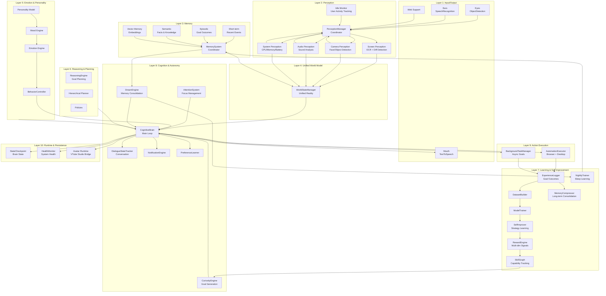

# Artificial Life

A project on developing an all rounder AI and actually trying to have its own thought process and be usable for future data and not just past.

## Overview

This repository contains implementations of artificial life simulations, including agent-based models and evolutionary systems while also dividing and modeling each component based on how living organisms function.

## Features

- Agent-based simulation framework
- Environmental interaction systems
- Evolutionary algorithms
- Data visualization tools

## Getting Started

### Prerequisites
- Python 3.8+
- Required dependencies listed in `requirements.txt`

### Installation

```bash
git clone <repository-url>
cd artificial_life
pip install -r requirements.txt
```

### Usage

```bash
python main.py
```

Text-only test mode (no voice input):

```bash
python text_mode.py
```

## Current System Architecture

This is the current system architecture on which this is being built, it is subjected to change as more features and improvements are done in future.



## Idle-Aware Behavior & Background Tasks

The agent respects your activity and won't interrupt your work with foreground browsing or information gathering.

### How it works

1. **User Activity Monitoring** (Windows only)
   - The agent tracks keyboard + mouse input to determine your activity level
   - Idle threshold: **1 hour of no input** = user is idle

2. **Autonomous Work Scheduling**
   - When the agent wants to explore or research something (**curiosity goals**):
     - **If you're active** (< 1 hour idle): work happens in **background threads** — non-blocking
     - **If you're idle** (≥ 1 hour): work happens in the **foreground** — agent can browse, collect info, etc.
   - **User instructions** and **scheduled tasks** always execute as directed (background or foreground)

3. **Task Management**
   - Background tasks are tracked and can be monitored via `/status` in text mode
   - Tasks auto-clean up after completion
   - On shutdown, all background tasks are cancelled gracefully

### Checking agent activity

```bash
python text_mode.py
you> /status
```

Output will show:
- `idle_monitor`: user idle time in seconds, is user idle >= 1 hour
- `background_tasks`: list of active background curiosity goals being explored

### Background task execution details

When the agent runs a task in background:
- Goal executes on a separate thread pool
- Main brain loop stays responsive
- Skill learning and memory updates still occur
- You can interact with the agent or give new instructions without blocking


